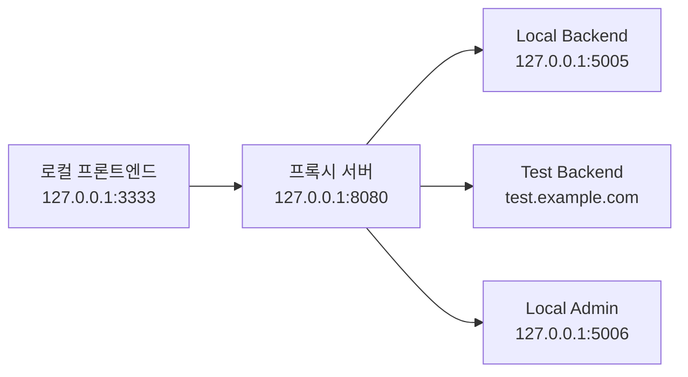

# 개발 환경 프록시 서버 개발기 (2편)

## 구체적인 작업 목표

요구 사항은 이렇다.
- 당장 작업 대상이 아닌 레포는 로컬 구동이 불필요 할 것.
- 인증/인가 기존대로 가능할 것.
- 작업 대상, 그에 필요한 서버 구성이 바뀌더라도 간단하게 세팅할 수 있을 것.

앞선 시도에서 알게된 것들은 이랬다.
- 대부분의 백엔드 서버는 테스트 환경을 바라보게 해도 프론트엔드 개발에 지장이 없다.
- 인증 서버까지 테스트 환경을 바라보게 하고, 그 토큰을 프론트에 써줄 수만 있으면 오케이.

그래서 이런 그림을 그렸다.
// 로컬 프론트엔드 -> 브라우저에 토큰을 써줄 수 있는 로컬 인증 서버 <-> 로컬/테스트 인증 서버
// 로컬 프론트엔드 -> 로컬/테스트 서비스 서버

여기에, 기존 로컬 환경 변수 변경 프로세스 자체에서 발생하던 비효율도 제거하고 싶었다.
- 로컬 환경 변수를 변경하려면 
  a. 로컬에서 next.config.js 와 같은 서비스 환경 설정 파일을 수정한다. 
    => 실수로 함께 커밋하는 일도 다반사.
  b. vercel 등 원격 관리되는 환경 변수의 로컬 값을 변경한다.
    => 내 설정이 다른 동료에게 전파!
  c. vercel 등에서 로컬로 당겨온 다음, 생성된 .env.local 등의 환경 설정 파일을 수정한다.
    => 이건 그나마 사이드이펙트가 적었다. 하지만 이전에 바꿔두고 잊어버리는 바람에 히든 버그의 원인이 되기도!
- 심지어 로컬에서 여러 서비스를 구동하고 있는 경우, 각 서비스에서 환경 변수를 관리하고 있는 방식으로 각각, 그러나 똑같은 설정으로 바꿔줘야한다!
- 그러다 작업 대상 레포가 일부 추가되거나, 줄어드는 경우... 다시 대상을 파악해 위 과정을 반복해야 했다.

## 해결책 구상: 개발자 경험을 중심으로 한 아키텍처 설계

다중 서비스 환경에서 발생하고 있던 복잡성을 해결하기 위해 가장 먼저 떠올린 키워드는 "일원화"였다. <br/>
로컬 통신을 위한 모든 레포지토리 엔드포인트를 한 곳에서 관리하자.<br/>
로컬에서 다른 레포와 통신할 때는 이 설정을 알고 있는 중앙 서버를 거치게 하자.<br/>

그 다음으로 떠올린 것은 "원격 설정과 개인 설정의 분리".<br/>
원격 설정: 실제 엔드포인트 값은 원격에서 중앙 관리한다.<br/>
개인 설정: 내 로컬 환경에서 특정 서비스의 환경을 바꾸고 싶을 때는 서비스 코드나 원격 환경 변수를 수정하는 일이 없어야 한다.<br/>

구체화한 목표를 가지고 프로젝트의 이름을 정했다.

- 통합: 모든 레포를 대상으로, 각각 어떤 환경을 바라보게 할지 중앙에서 설정할 수 있게 하자
- 로컬: 로컬에서 구동하는 레포들은 해당 설정을 참조하게 하자
- 프록시 서버: 다른 레포와 통신을 중개하는 서버를 하나 두자


클라이언트는 항상 127.0.0.1:8080으로만 요청을 보내고, 프록시 서버가 현재 설정에 따라 적절한 실제 서비스로 라우팅하는 구조.

이렇게 큰 가닥을 잡고, 세부 설계를 그리기 시작했다. (feat. claude)


### 변수는 흐른다

1단계: services.yaml을 통한 서비스 정의
```yaml
services:
  service-a-frontend:
    name: A_APP_URL
  service-a-backend:
    name: A_API_URL
  service-b-frontend:
    name: B_APP_URL
  service-b-backend:
    name: B_API_URL
```
운영 중인 서비스 목록이다. 여기에 나열된 서비스가 환경 설정의 대상이 된다.
새로운 서비스 추가 시 이 파일에 메타데이터만 추가하면 된다.

키에는 레포지토리명을, name 에는 .env 파일에 쓰일 키를 입력한다.
레포지토리명을 .env 키로 바로 쓰지 않으 것은, 헷갈리는 레포지토리 이름이 많은데 이제와서 레포지토리명을 바꿀 수는 없었기 때문.
별칭을 지어주는 정도로 생각하면 된다.


2단계: 로컬 설정 파일 (.dev-cli-env)
```env
  service-a-frontend: local
  service-a-backend: test
  service-b-frontend: test
  service-b-backend: test
```

개발자가 CLI를 통해 선택한 환경 설정을 저장하는 중간 파일. 
이 파일은 Git에 커밋되지 않아 개발자별로 독립적인 설정을 유지할 수 있다. 초기 설계했던 "설정의 분리" 중 개인 설정에 해당한다.

3단계: AWS SSM 파라미터 스토어 연동
```
# AWS SSM에서 환경별 실제 엔드포인트 조회
def get_service_url(service_name: str, environment: str) -> str:
    parameter_path = f"/team-sparta/{service_name}/{environment}"
    response = ssm_client.get_parameter(Name=parameter_path)
    return response['Parameter']['Value']
  ```

실제 서비스 엔드포인트 정보는 AWS SSM에서 중앙 관리한다. 초기 설계했던 "설정의 분리" 중 원격 설정에 해당한다.
이렇게 하면 아래 이점을 얻을 수 있다.
- 환경별 URL 변경 시 코드 수정 없이 SSM 파라미터만 업데이트
- 보안이 중요한 엔드포인트 정보의 암호화 저장
- 인프라 팀의 중앙 집중식 관리 가능

4단계: 런타임 환경 변수 생성 (.env.local)
```env
# 자동 생성되는 .env.local
ONLINE_BACKEND_URL=http://127.0.0.1:5005
ADMIN_BACKEND_URL=https://testadmin.spartacodingclub.kr
PAYMENT_SERVICE_URL=http://127.0.0.1:5007
```
프록시 서버 시작 시 1단계와 2단계의 정보를 조합하여 실제 사용할 환경 변수를 생성한다.

<br/>
이렇게 개발자가 환경 설정에 신경 쓰지 않고 비즈니스 로직에만 집중할 수 있는 개발 환경을 만들어낼 수 있었다.<br/> 
