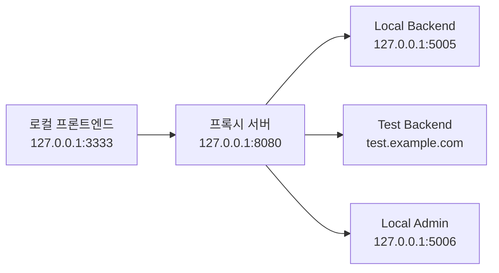

# 개발 환경 프록시 서버 개발기 (2편)

## 해결책 구상: 개발자 경험을 중심으로 한 아키텍처 설계
다중 서비스 환경에서 발생하는 복잡성을 해결하기 위해 가장 먼저 떠올린 키워드는 "통합"이다. <br/>
개발자가 직접 서비스 코드를 수정하지 않고도, 로컬에서 바라볼 다른 레포의 환경을 변경할 수 있어야 했다.<br/>

- 통합: 모든 레포를 대상으로, 각각 어떤 환경을 바라보게 할지 중앙에서 설정할 수 있게 하자
- 로컬: 로컬에서 구동하는 레포들은 해당 설정을 참조하게 하자
- 프록시 서버: 다른 레포와 통신을 중개하는 서버를 하나 두자

이로써 "통합 로컬 프록시 서버" 라는 이 프로젝트의 이름이 정해졌다.





이렇게 큰 가닥을 잡고, 세부 설계를 그리기 시작했다. (feat. claude)

이 접근 방식의 핵심은 개발자가 환경 변경을 위해 코드를 수정할 필요가 없도록 하는 것이었습니다. 
클라이언트는 항상 127.0.0.1:8080으로만 요청을 보내고, 프록시 서버가 현재 설정에 따라 적절한 실제 서비스로 라우팅하는 구조입니다.


### 환경 변수 관리 전략: 3단계 접근법
1단계: 로컬 설정 파일 (.dev-cli-env)
```env
  service-a-frontend: local
  service-a-backend: test
  service-b-frontend: test
  service-b-backend: test
```

개발자가 CLI를 통해 선택한 환경 설정을 저장하는 중간 파일입니다. 이 파일은 Git에 커밋되지 않아 개발자별로 독립적인 설정을 유지할 수 있습니다.

2단계: AWS SSM 파라미터 스토어 연동
```
# AWS SSM에서 환경별 실제 엔드포인트 조회
def get_service_url(service_name: str, environment: str) -> str:
    parameter_path = f"/team-sparta/{service_name}/{environment}"
    response = ssm_client.get_parameter(Name=parameter_path)
    return response['Parameter']['Value']
  ```

실제 서비스 엔드포인트 정보는 AWS SSM에 중앙 관리됩니다. 이렇게 하면:
- 환경별 URL 변경 시 코드 수정 없이 SSM 파라미터만 업데이트
- 보안이 중요한 엔드포인트 정보의 암호화 저장
- 인프라 팀의 중앙 집중식 관리 가능

3단계: 런타임 환경 변수 생성 (.env.local)
```env
# 자동 생성되는 .env.local
ONLINE_BACKEND_URL=http://127.0.0.1:5005
ADMIN_BACKEND_URL=https://testadmin.spartacodingclub.kr
PAYMENT_SERVICE_URL=http://127.0.0.1:5007
```

프록시 서버 시작 시 1단계와 2단계의 정보를 조합하여 실제 사용할 환경 변수를 생성합니다.


### 아키텍처 설계의 핵심 의사결정: 확장성을 고려한 설계
services.yaml을 통한 서비스 정의
```yaml
  services:
    service-a-frontend:
      name: A_APP_URL
    service-a-backend:
      name: A_API_URL
    service-b-frontend:
      name: B_APP_URL
    service-b-backend:
      name: B_API_URL
  ```
새로운 서비스 추가 시 이 파일에 메타데이터만 추가하면 되도록 설계하여, 프록시 서버의 확장성을 확보했습니다.
이러한 해결책 구상 과정을 통해 우리는 개발자가 환경 설정에 신경 쓰지 않고 비즈니스 로직에만 집중할 수 있는 개발 환경을 만들어낼 수 있었습니다. 모든 설계 결정은 "개발자 경험을 어떻게 향상시킬 것인가?"라는 질문에서 출발했으며, 이는 프로젝트의 성공에 결정적인 역할을 했습니다.


서버 프레임워크로는 Python FastAPI 를 골랐다. 내가 python 에 익숙하기도 하고, 구축이 제일 가벼웠기 때문에.


